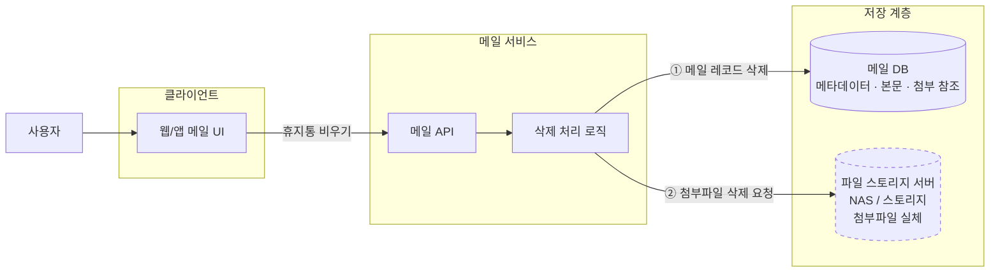

# 휴지통 비우기 실행 후 이메일 서비스 장애

---

## 1. 상황 및 문제 정의

### 1.1 상황

#### 1.1.1 시스템 구성도

> **이 그림에서 주목할 두 가지**
>
> 1. **파일 스토리지가 외부 자원이다** (점선). 삭제 시 이 서버로의 호출은 **네트워크 경계를 넘는 I/O**이며, 메일 서비스는 이 호출의 지연과 실패를 스스로 통제할 수 없다.
> 2. **삭제 흐름과 일반 이용 흐름이 같은 메일 서비스를 통과한다.** 한 사용자의 삭제 작업이 다른 사용자에게까지 번지려면 둘 사이에 공유 지점이 있어야 하는데, 이 그림에서 그 후보는 **메일 서비스의 서버 자원**(스레드·커넥션 풀), **메일 DB**, **파일 스토리지** 세 곳이다. 어느 지점이 실제 전파 경로였는지는 2장에서 검증한다.
>
> ※ 메일 송수신 경로(SMTP·IMAP을 처리하는 별도 서버 존재 여부, 웹 API와의 자원 공유 여부)는 **미확인**이므로 이 그림에서는 "다른 사용자 트래픽"으로 일반화해 표기했다. 1.4 확인 필요 사항 참조.